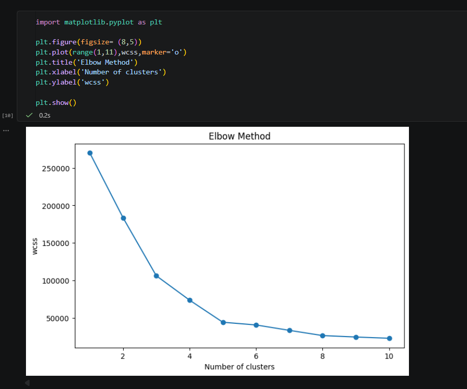
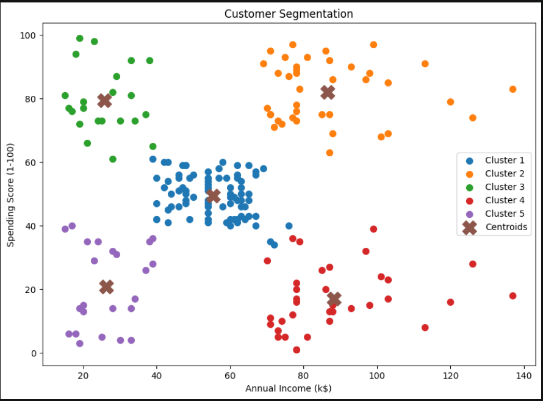

 # Customer Segmentation using K-Means Clustering

## Project Overview

This project groups mall customers into different segments based on their Annual Income and Spending Score using the K-Means Clustering algorithm.

The objective is to identify customer groups that can help businesses improve marketing strategies.

## Dataset

Mall Customers Dataset

Features:

* CustomerID
* Gender
* Age
* Annual Income (k$)
* Spending Score (1-100)

## Technologies Used

* Python
* Pandas
* NumPy
* Matplotlib
* Scikit-Learn
* Jupyter Notebook

## Machine Learning Workflow

1. Data Loading
2. Exploratory Data Analysis
3. Feature Selection
4. Elbow Method
5. K-Means Clustering
6. Cluster Visualization
7. Customer Segment Analysis

## Elbow Method

## Customer Segmentation

## Cluster Analysis

### Cluster 1

Average customers

### Cluster 2

Premium customers (High Income, High Spending)

### Cluster 3

Impulsive shoppers (Low Income, High Spending)

### Cluster 4

Rich but careful customers (High Income, Low Spending)

### Cluster 5

Budget customers (Low Income, Low Spending)

## Conclusion

The K-Means algorithm successfully segmented customers into 5 distinct groups. These insights can help businesses target different customer categories more effectively.
